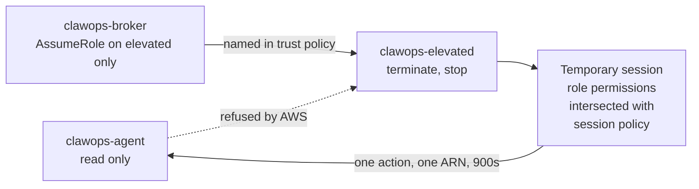
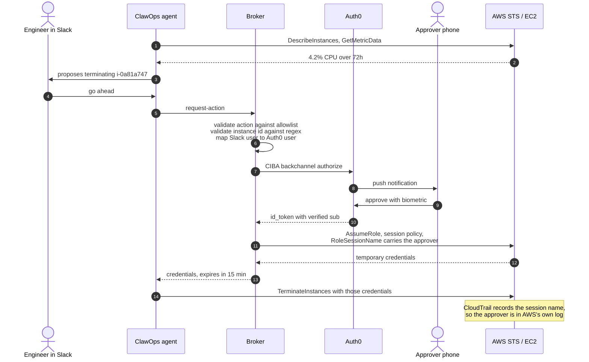

# ClawOps

An ops agent that lives in Slack, can read your AWS account, and **cannot change
anything** — until a named human approves the specific action on their phone.

At that moment the agent is handed AWS credentials that can do exactly one thing,
to one instance, for fifteen minutes. Then they stop working.

***

## The problem

Every AI ops tool on the market runs with one standing IAM role broad enough to
cover everything it might ever need — all day, whether it's working or not. That
single fact is why regulated organisations won't deploy them.

ClawOps inverts it. The agent's own AWS identity can `Describe` and read metrics.
It holds no write permission at all, so an agent that gets prompt-injected through
a log line doesn't get a refusal from our code — it gets `AccessDenied` from AWS.

Write access is minted per-action, per-approval, per-resource, and expires.

***

## 🌱 Sustainability & Green Computing

Cloud infrastructure is one of the fastest-growing contributors to global carbon emissions. Studies estimate that **up to 30% of cloud servers are idle or significantly underutilised** at any given time — consuming power without delivering value.

ClawOps directly addresses this by applying AI-driven observability to infrastructure efficiency:

- **Detects idle and underutilised servers** — identifies instances running below meaningful CPU/memory thresholds over sustained periods
- **Recommends or auto-executes green actions** — suggests stopping, pausing, or right-sizing instances to eliminate wasteful compute
- **Estimates carbon impact** — maps server utilisation to estimated energy consumption and CO₂ output using regional grid carbon intensity (e.g. UAE grid: ~0.4 kg CO₂/kWh)
- **Tracks sustainability over time** — leverages NanoClaw's persistent memory to surface trends like "this server has been under 5% CPU for 3 days"

### Carbon Footprint Estimation (Planned)

ClawOps will expose a sustainability summary per instance:

```
Instance:     prod-worker-3
Avg CPU:      4.2% (last 72h)
Est. Power:   ~9W attributable draw
Est. CO₂:     ~0.26 kg over 72h  (0.65 kWh x 0.4 kg/kWh, UAE grid)
Recommendation: STOP instance — save ~0.26 kg CO₂ and ~$12/month
```

This aligns directly with **UAE Net Zero 2050** goals, enabling enterprises and developers to make infrastructure decisions that are not just operationally sound, but environmentally responsible.

***

## How permission works

Two identities and a role. This is the entire security design.

| Identity | Can do | Who uses it |
|---|---|---|
| `clawops-agent` | `ec2:Describe*`, `cloudwatch:Get*` | The agent, always |
| `clawops-broker` | `sts:AssumeRole` on the elevated role, nothing else | The broker process |
| `clawops-elevated` | `ec2:TerminateInstances`, `ec2:StopInstances` | Nobody by default |

`clawops-elevated` has a trust policy naming only `clawops-broker`. The agent is
not on that list, so if it discovers the role's ARN and tries to assume it, AWS
refuses. Not because of a check we wrote — because the trust policy doesn't name it.



The session policy passed at mint time can only *narrow*. Credentials can do the
overlap between what the role allows and what the policy allows, so there is no
way to request more than the role already had. 900 seconds is the AWS floor for
`AssumeRole`, not a number we picked.

***

## The flow



### Why the broker exists

Auth0 cannot mint AWS credentials — only STS can, and something has to call it.
If the agent made that call, the agent would choose its own session policy and
would simply ask for everything. The broker exists because the narrowing has to
be written by something that isn't the agent.

The broker treats everything the agent sends as untrusted:

- the action must be in a fixed allowlist — anything else is rejected before Auth0 is ever contacted
- the instance ID must match `^i-[0-9a-f]{8,17}$`
- the elevated role ARN is hardcoded in the broker; the agent never names a role

So a compromised agent cannot escalate, and cannot even cause a phone to ring for
an action outside the allowlist.

### Why CIBA rather than a Slack button

A Slack button click proves a request came from Slack. It does not prove who
clicked it — a hijacked session approves its own requests. Auth0's Client-Initiated
Backchannel Authentication sends the approval to a separate enrolled device, where
it's confirmed with biometrics, and returns a verified identity.

That identity goes into `RoleSessionName`, which means CloudTrail — a log we cannot
edit — records a named human behind every infrastructure change. The audit trail
isn't something we built; it falls out of the design.

---

## Surfaces and providers

The design has two seams. Only one implementation exists behind each today, and
this section is about where the others would slot in — not a claim that they work.

### Where the conversation happens

The broker exposes `POST /request-action` and takes plain JSON. It contains no
Slack code and imports no Slack library. The only Slack-shaped thing anywhere near
it is `APPROVER_MAP`, a lookup from a chat platform's user ID to an Auth0 user ID.

So moving to Microsoft Teams, Discord, a web console, a CLI, or a ticket comment
means writing an adapter that calls one HTTP endpoint and re-keying that map. The
security model doesn't change at all, because the approval never travelled through
the chat platform in the first place — it went to a phone.

That's the useful property. In a design where a chat button is the approval, every
new surface is a new trust problem: you have to reason about who can click in
Teams, how that platform signs its requests, whether a compromised account can
approve its own request. Here the chat surface is only where the *asking* happens.
Whichever one you bolt on, the human still confirms on an enrolled device with
biometrics, and the identity that reaches CloudTrail comes from Auth0 rather than
from the chat platform.

**Implemented:** Slack, via NanoClaw.
**Not implemented:** everything else. The endpoint is ready for them; no adapters
are written.

### Which cloud

`providers/interface.ts` defines a `CloudProvider` seam for reading metrics and
describing instances, and `providers/aws.ts` is the only implementation.

Minting is the harder half, and worth being precise about, because the pattern
transfers but the primitives genuinely differ:

| | Narrowing primitive | Notes |
|---|---|---|
| **AWS** | `AssumeRole` with an inline session policy | Implemented. One call narrows to a single action on a single ARN. Minimum lifetime 15 minutes. |
| **GCP** | Service account impersonation, optionally with a credential access boundary | Impersonation with a short lifetime is straightforward; boundary-based downscoping has historically been limited in which services it covers, so per-resource narrowing may need a dedicated service account per scope instead. |
| **Azure** | Time-bound role assignment at a resource scope; Entra PIM for just-in-time elevation | PIM is arguably the closest existing product to what this project does, including its own approval step — the interesting version on Azure is driving PIM activation from the agent rather than reimplementing it. |

The broker would grow a `mint(plan)` per provider behind a common interface. The
validation, approval and ledger paths above it are provider-agnostic already.

**Implemented:** AWS (EC2, CloudWatch, STS).
**Not implemented:** GCP and Azure. The read interface exists; no minting code does.

---

## What is actually built

- Read-only monitoring of EC2 instances via CloudWatch, running inside NanoClaw
- Slack as the conversation surface, two-way
- The broker: validation, CIBA approval, scoped STS minting, SQLite plan ledger
- The three IAM identities and the trust policy that enforces the separation
- Terminate and stop, end to end, with human approval on a phone

## What is not

- Carbon estimation. The idea is in the roadmap below; none of it ships.
- GCP and Azure. The read interface exists; no minting code does. See above.
- Teams, Discord, or any surface other than Slack. The broker endpoint is
  surface-agnostic, but no adapter is written.
- Instance creation, baselines, automatic expiry sweeps, SSM investigation.
- Terraform for the IAM setup. Created via CLI; see `docs/iam-setup.md`.

---

## Known limitations

**Rich Authorization Requests are registered but unused.** The Auth0 Guardian push
renderer rejects custom `authorization_details` schemas, so the phone prompt cannot
currently display the instance ID as structured consent data. The `binding_message`
carries the action and instance instead, which is weaker but readable. Resolving
this needs either a Guardian-compatible schema or a custom notification channel.

**The API's application access policy is relaxed.** `require_client_grant` is the
correct production setting. It is set to allow-all here so the demo works on a
throwaway tenant.

**The broker holds a long-lived AWS key.** It can do nothing except assume one
role, but it is still a standing credential. The correct next step is
`AssumeRoleWithWebIdentity` with Auth0 registered as an IAM OIDC provider — then
the approval token *is* the credential and the broker holds nothing at all. That
requires an OIDC provider registration and a federated trust policy, which is the
first thing we'd build next.

**Read is not harmless.** Logs contain customer data. "It can only read" is a
weaker promise in a bank than it sounds, and the read-only role needs its own
scoping story rather than a wave-through.

**We moved the power, we did not delete it.** The broker can still mint dangerous
credentials. The window shrank from always-on to fifteen minutes with a human in
it, which is a real improvement, but worth saying plainly.

**The Auth0 tenant is on a trial.** CIBA and RAR require an Enterprise plan or
add-on. Anyone cloning this will need their own entitled tenant.

---

## Running it

Requires an AWS account, a Slack workspace, and an Auth0 tenant with CIBA enabled.

```bash
npm install
```

### AWS

Create the two users and the role as described in `docs/iam-setup.md`. Confirm the
separation actually holds before going further:

```bash
# should fail — this is the point of the project
aws sts assume-role \
  --role-arn arn:aws:iam::ACCOUNT:role/clawops-elevated \
  --role-session-name test --profile clawops-agent
```

### Auth0

1. Create a Regular Web Application. Settings → Advanced → Grant Types → enable
   Client Initiated Backchannel Authentication.
2. Reload, then choose Guardian push as the notification channel.
3. Create an API with identifier `https://clawops/api`.
4. On that API, set the User Consent Policy to a non-MFA option — CIBA is refused
   on audiences using transactional authorization with MFA, because Guardian is
   already performing the MFA step.
5. Create a user for each approver and enrol their phone in Guardian.

### Configure

`.broker.env` — never `.env`, which is not git-ignored:

```
AUTH0_DOMAIN=your-tenant.us.auth0.com
AUTH0_CLIENT_ID=
AUTH0_CLIENT_SECRET=
AWS_ACCOUNT_ID=
AWS_REGION=me-central-1
APPROVER_MAP={"SLACK_USER_ID":"auth0|AUTH0_USER_ID"}
```

`APPROVER_MAP` decides whose phone rings. It does not decide the outcome — the
approver still has to tap. A lying agent can at most route a push to a real
approver, who then denies it.

### Run

```bash
AWS_PROFILE=clawops-broker node src/broker/server.ts
```

```bash
curl -X POST localhost:3001/request-action \
  -H 'Content-Type: application/json' \
  -d '{"action":"ec2:TerminateInstances","instanceId":"i-...","reason":"idle 3 days","requestedBy":"SLACK_USER_ID"}'
```

The request blocks until you approve or deny on your phone, then returns scoped
credentials or a refusal.

---

## Proving the credentials are narrow

With the returned credentials exported:

```bash
# the approved instance — permitted
aws ec2 terminate-instances --instance-ids i-APPROVED --dry-run

# any other instance — denied
aws ec2 terminate-instances --instance-ids i-OTHER --dry-run

# reading — also denied; the elevated role has no read permission
aws ec2 describe-instances
```

***

## Roadmap

Nearest first:

1. `AssumeRoleWithWebIdentity` so the broker holds no standing AWS credential
2. Guardian-compatible RAR so the phone shows structured consent data
3. Precondition re-check at mint time — the world moves while someone finds their phone
4. Instance creation, with scope by shape rather than by ARN
5. Expiry sweep that reclaims instances past their TTL through the same broker
6. Carbon estimation per instance, using real VM power draw rather than
   whole-server figures — a shared vCPU is closer to 5–15W than the 180W a
   physical host draws

## Stack

TypeScript, NanoClaw, Claude Agent SDK, Slack, Auth0 (CIBA), AWS SDK v3, SQLite, Express.
